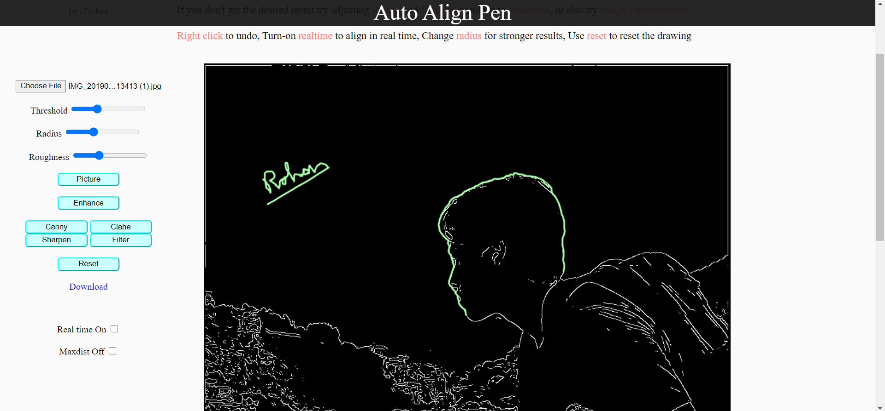

# Auto-align-pen

### Demo
https://r7rohan.github.io/Auto-align-pen/

Online tool for auto pen alignment. Drawing can be automatically aligned with the edges, either in realtime or when you release your mouse. It is similar to the magnetic lasso feature but has many more options to draw smooth computer aided traces. Additionally, Image enhancements such as canny edge detection, clahe, sharpening can also be done. 

### [Demo video](demo.mkv)
### Features
- Webpage for auto-alignment and image enhancement

- Drawing can be done and undone on any picture uploaded. It can then be downloaded like any normal editor

- Aligns the drawing with the edges in the picture (`windowed Canny edge detection`)  
Two alignment modes: 
`With the user`: Alignment will be done while drawing and will help the user to draw  
`After mouse release`: Alignment will be done when the user releases mouse-hold.  In this mode only the last drawing segment is aligned for the ease of the user drawing

- Image Enhancements can be applied (`Canny edge detection, CLAHE, Sharpen, Custom filters`)
  
`Picture`: Show the actual picture  
`Enhance`  
->  `Canny` : Show the edges  
->  `Clahe` : Apply clahe-histogram-equalisation  
->  `Sharpen` : Sharpen  
->  `Custom Filter` : Apply a custom filter  
`Threshold`: Select the edge threshold  
`Radius`: Max distance for alignment   
`Roughness`: Set the roughness  
`Real time on`: Alignment will be done while the user draws  
`Right click`: Undo the last change  
`Reset`: Remove the drawing  
`Maxdist off`: Align with anything, distance will not matter  

### Working
- Drawing is processed into different stroke pixels and the picture is converted to edges. Each drawn pixel is aligned to its optimum neighbour among the edge pixels (uses windowed-edge detection for fast execution). 

- Edge detection is done using Canny edge detection.

- Nearest neighbour is implemented using linear search in the neighbour.

- Few heuristics are applied for smooth and realistic alignment

- Custom Enhancement module is written containing sobel, canny edge detection, clahe, apply filter, convolutions

- Written in javascript